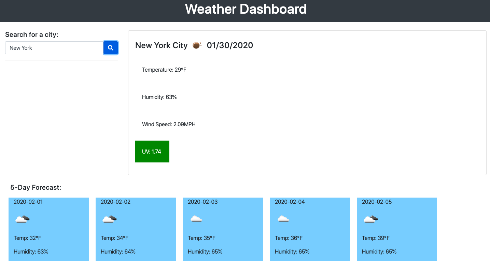

# Weather Dashboard

## You can see this project and test its features by visiting: 

# User Story
### AS A traveler

### I WANT to see the weather outlook for multiple cities

### SO THAT I can plan a trip accordingly

# Project Criteria 

 ### This project is created using HTML, Bootstrap, jQuery and Javascript.
 ### Used the OpenWeather API to retrieve city data such as temp, humidity, windspeed,uv index and date. 

