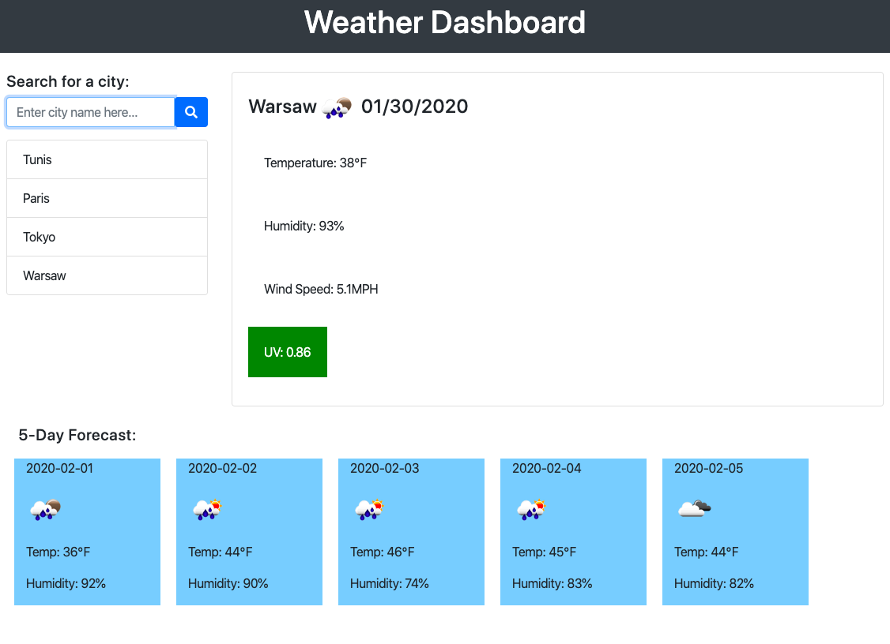
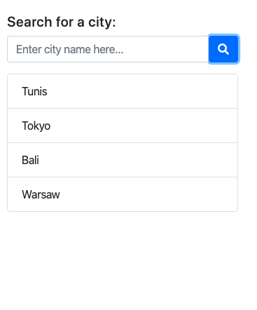

# Weather Dashboard

## You can see this project and test its features [here](https://rimaodolski.github.io/WeatherDashboard/)

# User Story
 AS A traveler

I WANT to see the weather outlook for multiple cities

SO THAT I can plan a trip accordingly

# Project Criteria 

This project uses the [OpenWeather](https://openweathermap.org/api) Current Weather Data, 5 Day / 3 Hour Forecast, and UV Index apis.

This project uses [Moment.js](https://momentjs.com/).

This project uses [Bootstrap 4](https://getbootstrap.com/).

The Search button icon is from [Font Awesome](https://fontawesome.com/).

